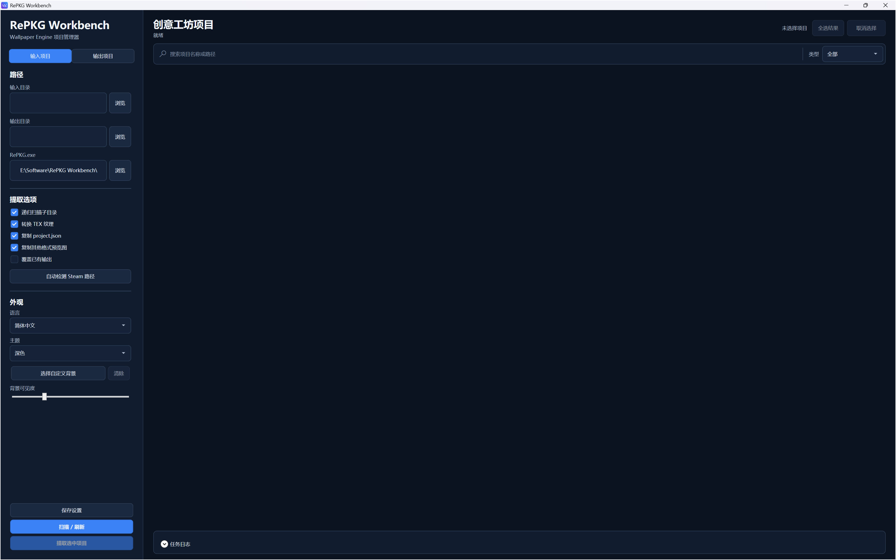
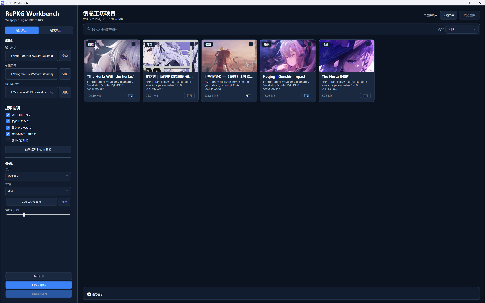
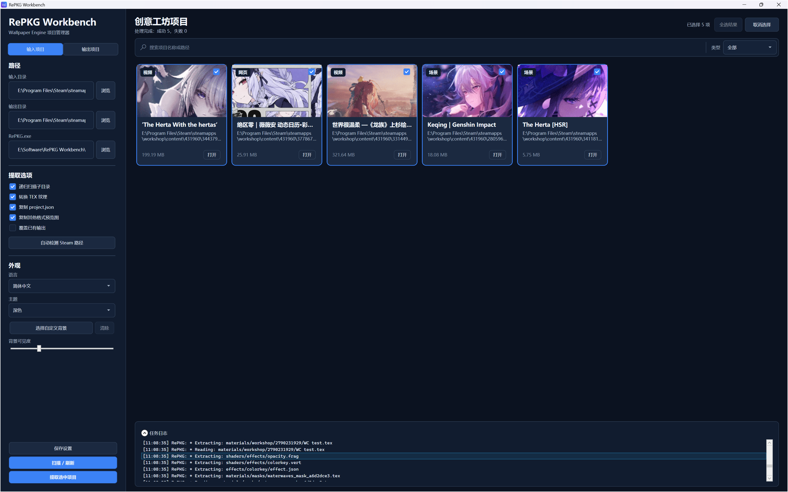
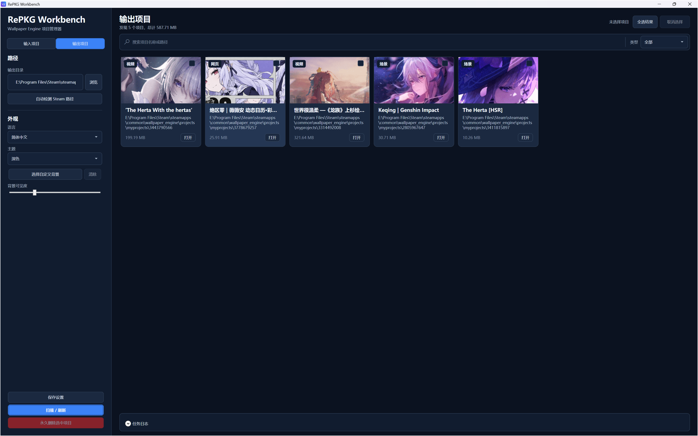
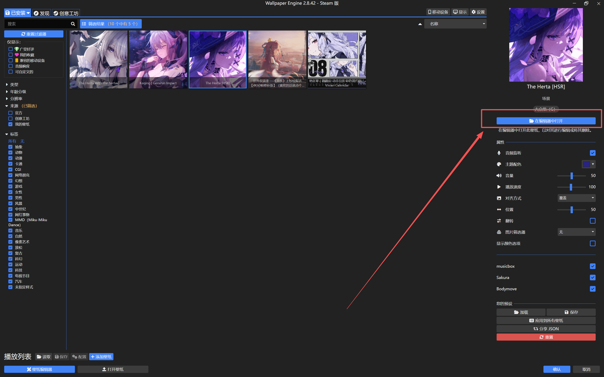

# RePKG Workbench

简体中文 | [English](README.md)

RePKG Workbench 是一款 Windows 桌面应用，为 RePKG 提供原生 WPF 图形界面，用于浏览、提取和管理本地 Wallpaper Engine 创意工坊项目。



## 主要功能

- 自动查找 Wallpaper Engine 项目，或扫描用户指定的目录
- 识别场景、视频、网页和应用程序项目
- 展示项目元数据以及静态图片、GIF 动图和静音循环视频预览
- 按名称搜索、按类型筛选，并支持单选或批量选择
- 使用随程序提供的 RePKG 命令行工具提取场景项目
- 将视频、网页和应用程序项目复制为可用的输出目录结构
- 实时显示进度和详细任务日志，并支持取消任务
- 在独立的输出视图中管理已提取项目
- 支持简体中文与英文（其他语言需自行在Language下创建JSON配置）、浅色/深色主题和自定义背景
- 将设置保存在 `%LocalAppData%\RePKG-Workbench` 本地目录

## 下载与版本选择

请在项目的 Releases 页面选择合适的软件包：

- `RePKG-Workbench-Setup-x64.exe` — 标准 Windows 安装包，需要 .NET 10 Desktop Runtime (x64)；缺少运行库时，安装程序会引导前往 Microsoft 下载。
- `RePKG-Workbench-Portable-x64.zip` — 推荐的便携包，已包含所需的 .NET 运行库，无需单独安装 .NET。
- `RePKG-Workbench-Portable-FDD-x64.zip` — 体积较小的便携包，适合已经安装 .NET 10 Desktop Runtime (x64) 的电脑。

当前软件包均面向 64 位 Windows。如果不确定如何选择，请使用自带运行库的 **Portable** 便携包。

## 快速开始

1. 安装应用，或将便携包解压到可写目录。
2. 启动 `RePKG-Workbench.exe`。
3. 将**输入目录**设置为 Wallpaper Engine 创意工坊内容目录。常见位置为：
  ```text
   C:\Program Files (x86)\Steam\steamapps\workshop\content\431960
  ```
   如果 Wallpaper Engine 位于可识别的 Steam 库中，也可以使用**检测 Steam 路径**。
4. 将**输出目录**设置为保存已提取项目的文件夹。建议使用**Wallpaper Engine的My Projects 路径，**，检测Steam路径会自动按该路径填充。
  - 配置完成后建议保存设置
5. 保留程序自动识别的内置 `RePKG.exe`，或选择其他自行提供的REPKG可执行文件。
6. 按需选择提取选项，然后点击**扫描 / 刷新**。
7. 选择一个或多个项目，再点击**提取选中项**。


### 1. 扫描与预览

项目卡会显示预览、标题、类型、大小和相关路径。可以通过搜索框和类型筛选器缩小结果范围。



### 2. 提取项目

选择所需的项目卡并开始提取。任务日志会显示每项操作及其结果。

> 其他方式：
>
> - 支持在项目卡右键进行提取。
> - 支持拖入完整的项目文件夹或含多个项目的文件夹到应用窗口进行提取，拖入操作会自动执行提取。



### 3. 管理输出项目

切换到**输出项目**页面可检查提取结果。在这里删除项目会永久移除对应的输出目录，请在操作前仔细核对选中项。



## 提取选项

- **扫描子目录** — 递归查找包含 `project.json` 的项目文件夹。
- **转换 TEX 纹理** — 提取场景项目时转换受支持的 Wallpaper Engine TEX 纹理。
- **复制 project.json** — 在输出目录中保留源项目元数据。
- **复制备用预览图** — 在存在其他预览图片时一并复制。
- **覆盖现有输出** — 替换已有输出项目中的文件；如果需要保留现有内容，请勿启用。

场景项目通过 RePKG 解包；视频、网页和应用程序项目不会按场景包解包，而是复制到输出目录。按默认选项即可，详情查阅REPKG项目。

## 运行要求与常见问题

### Windows 提示需要 .NET 10 Desktop Runtime

安装版和 FDD 便携版需要 **.NET 10 Desktop Runtime (x64)**。它与 Windows 自带的 .NET Framework 不同。可以从 Microsoft 安装 x64 Desktop Runtime，也可以改用已经包含运行库的 `RePKG-Workbench-Portable-x64.zip`。

### 扫描不到项目

- 确认输入目录下存在带有 `project.json` 的项目文件夹。
- 扫描创意工坊根目录时，请启用**扫描子目录**。
- Wallpaper Engine 创意工坊内容通常位于 Steam 应用 ID `431960` 对应的目录。
- 如果 Steam 库位于其他磁盘，请尝试**检测 Steam 路径**。

### 场景项目提取失败

- 确认配置的 `RePKG.exe` 存在且可以访问。
- 展开任务日志，检查包文件名和 RePKG 返回的错误信息。
- 尝试使用具有写入权限且剩余空间充足的输出目录。

### 输出目录找不到壁纸图片

场景类项目通常是使用Spine等多个素材组合而成，**并不一定存在独立完整的壁纸图**，建议通过Wallpaper Engine的“我的壁纸”在编辑器中打开查看

